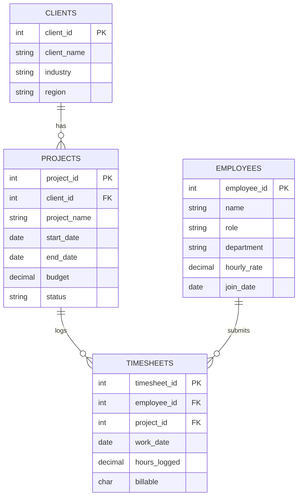

# Employee Utilization & Project Delivery Analytics (SQL)

An advanced SQL portfolio project modeling a consulting/professional-services business — employees, clients, projects, and timesheets — to answer real delivery-management questions: utilization rate, project margin, budget risk, and performance trends. Built to demonstrate SQL beyond basic SELECT/JOIN, including CTEs, window functions, stored procedures, triggers, transactions, and query optimization.

## Business Problem
Consulting and professional-services firms live or die by utilization (billable hours ÷ total hours) and project margin (billed value vs. cost). This project answers: *which employees and projects need attention, and how has performance trended over time?*

## Schema

A 4-table normalized schema: `clients` → `projects` → `timesheets` ← `employees`. Every timesheet entry ties one employee's logged hours to one project, which in turn belongs to one client — enabling multi-hop joins across the full delivery chain.

## Advanced SQL Techniques Demonstrated

| Technique | Where |
|---|---|
| CTEs (including chained/multi-step) | Monthly utilization ranking, LAG-based trend queries |
| Window functions — RANK, LAG | Rank employees by utilization within department; month-over-month change |
| Correlated subqueries | Flag employees below their own historical average |
| Conditional aggregation (manual pivot) | Billable vs non-billable hours split without a native PIVOT keyword |
| Views | `v_project_margin` — reusable cost-vs-budget calculation |
| Stored procedures with parameters | `GetLowUtilizationEmployees(threshold)` |
| Triggers | Auto-logs project status changes to an `audit_log` table |
| Transactions (COMMIT/ROLLBACK) | Demonstrated with a deliberate rollback scenario |
| Indexing + EXPLAIN | Measured query plan before/after adding an index — full table scan (1,177 rows) to indexed lookup (13 rows) |

## Query Results

## Sample Business Questions Answered
- What's each employee's utilization rate by month, and how does it rank within their department?
- Which employees have had a significant utilization drop compared to the previous month?
- Which employees are underperforming relative to their own historical average (not just a company-wide benchmark)?
- What's the cost-to-budget ratio for each active project?
- How does adding an index change the query plan for a common filter?

## Data
Synthetic dataset — 15 employees across 4 departments, 8 clients, 16 projects, and ~1,177 timesheet entries spanning March-June 2026. Deliberately includes a realistic utilization dip for two employees to make trend-detection queries demonstrable.

## Tools Used
MySQL Workbench 8.0

---
*Self-directed portfolio project — not affiliated with any employer or client data.*
